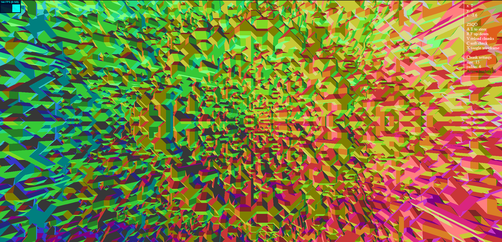
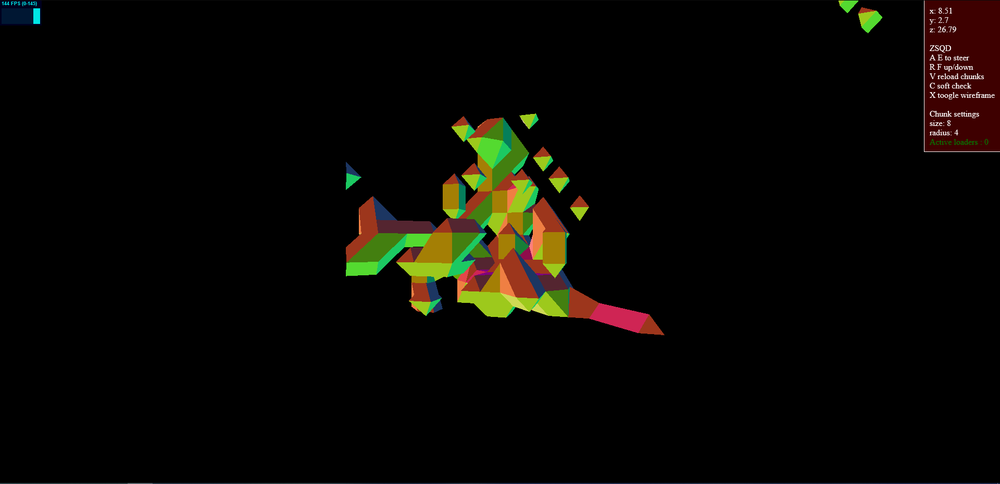
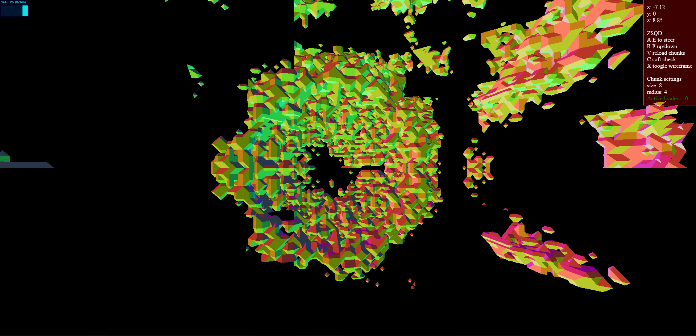

# [See it in action instead of reading it!](https://lele394.github.io/threejs_shenannigans/)
---

Liking what you see? drop me a  <a class="github-button" href="https://github.com/lele394/threejs_shenannigans" data-color-scheme="no-preference: light; light: light; dark: dark;" data-icon="octicon-star" data-size="large" data-show-count="true" aria-label="Star lele394/threejs_shenannigans on GitHub">Star</a>!

Wanna know how it'll go? <a class="github-button" href="https://github.com/lele394/threejs_shenannigans/subscription" data-color-scheme="no-preference: light; light: light; dark: dark;" data-icon="octicon-eye" data-size="large" data-show-count="true" aria-label="Watch lele394/threejs_shenannigans on GitHub">Watch</a> it!

Something is wrong? open an 

<a class="github-button" href="https://github.com/lele394/threejs_shenannigans/issues" data-color-scheme="no-preference: light; light: light; dark: dark;" data-icon="octicon-issue-opened" data-size="large" data-show-count="true" aria-label="Issue lele394/threejs_shenannigans on GitHub">Issue</a>

## Controls 🎮

| Controls         	| AZERTY 	| QWERTY 	|
|:----------------:	|:--------:	|:--------:	|
| Forward          	| Z      	| W      	|
| Left             	| Q      	| A      	|
| Backward         	| S      	| S      	|
| Right            	| D      	| D      	|
| Turn Left        	| A      	| Q      	|
| Turn Right       	| E      	| E      	|
| Up               	| R      	| R      	|
| Down             	| F      	| F      	|
| Open settings    	| Space  	| Space  	|
| Soft Chunk Check 	| C      	| C      	|
| Toggle Wireframe 	| X      	| X      	|
| Reset Chunks     	| V      	| V      	|

---

## A few words ✍️

#### Introduction
Hi, I'ml Léo, I like creating a bunch of stuff by smashing my keyboard. This project is part of my journey in 3D graphics. I've wanted to implement by myself the [Marching Cube](https://en.wikipedia.org/wiki/Marching_cubes) algorithm. I cannot state how much [this video](https://www.youtube.com/watch?v=KvwVYJY_IZ4)  helped me in debugging my code, I'm also using [Deadlock's triangulation table](https://pastebin.com/6TN46s9p).

#### Why do that

I've wanted to implement that algorithm due to a few games based on voxels that I always really liked :
 - [Astroneer](https://store.steampowered.com/app/361420/ASTRONEER/).
 - [Ace of spades](https://store.steampowered.com/app/224540/Ace_of_Spades_Battle_Builder/) and [Open Spades](https://openspades.yvt.jp/).
 - [Teardown](https://store.steampowered.com/app/1167630/Teardown/).
 - [Space Engineers](https://store.steampowered.com/app/244850/Space_Engineers/) asteroids.
 - And of course, everyone's favorite cube game, [Minecraft](https://en.wikipedia.org/wiki/Minecraft).

#### Current features

Currently, the demo has a working camera that you can control using the listed keybinds below.
You can toggle the wireframe by pressing X and reset chunks with V. Note that doing so will regenerate all the active chunks.  
If your computer allows it, you can enable the auto chunk check to always generate and load chunks in a radius around you. I have implemented Web Workers to generate each chunk. However the generation is done on the CPU. An active web worker counter is displayed in the info panel.  
Web workers are terminated if they are currently working on chunks that are no longer used, in order to avoid computations on chunks that won't be used.  
If the auto chunk check is not enabled (disabled by default), you can press C to refresh the active chunk list to chunks around you.  

#### Precautions with chunk radius
Please be careful when upping the chunk radius. It is generally better to increase the size of a chunk instead of teh radius, as each chunk will spawn a worker. A high radius leads to sometimes absurd amounts of workers; I do not recommend going past 5, which already spawns 515 of them.

#### Issues in Chrome and Opera
I'm aware of very bad performance in Chrome and Opera, however I do not think I have much control on that, though I'll look into it. No issues spotted running the demo on Firefox with a beefy machine. My setup runs an hexacore i5-10400 and a GTX-1660S and loads it pretty fast.

---
## Screenshots 🖼️

  
Fully generated Mandelbulb sphere.

 

  
random blob from appearing when surrounding chunks are not generated.

 

  
Partially generated Mandelbulb.

